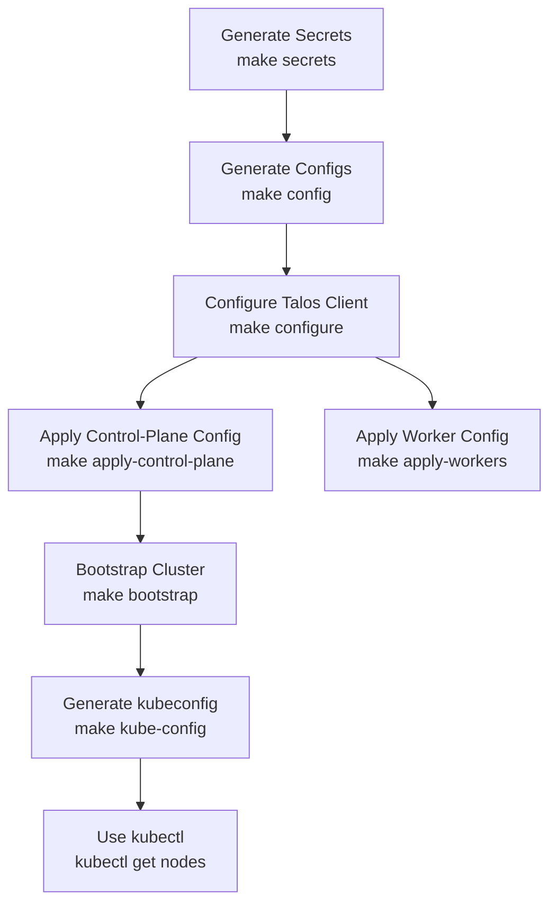

# Geron Cluster on Talos Linux (v1.8.1)

This repository contains **Makefile automation** and configuration files for deploying and managing the **Geron Kubernetes cluster** on [Talos Linux](https://www.talos.dev).  
It standardizes the workflow for generating secrets, creating Talos configs, applying them to nodes, and bootstrapping Kubernetes.

---

## Prerequisites

- [talosctl](https://www.talos.dev/v1.8/talosctl/installation/) installed locally.
- `nodes.ini` configured with your control-plane and worker nodes:
  ```ini
  [control-plane]
  10.10.0.7
  10.10.0.8

  [worker]
  10.10.0.11
  10.10.0.15
  ```
- Patches in `patch/` directory:
  - `all.yaml` → common settings for all nodes (e.g. cluster name, network defaults, disk installation, networking)
  - `control-plane.yaml` → extra configuration for control-plane nodes
  - `worker.yaml` → extra configuration for worker nodes

---

## Workflow Overview

The **Makefile** automates the cluster setup. The main steps:

1. **Generate secrets** → creates `secrets.yaml`
2. **Generate configs** → creates Talos manifests into `manifests/`
3. **Configure talosctl** → points your client to the first control-plane node
4. **Apply configs** → pushes configuration to all nodes
5. **Bootstrap cluster** → initializes Kubernetes control-plane
6. **Generate kubeconfig** → creates `manifests/config` for `kubectl`

---

## Visual Workflow



---

## Commands

### Show available commands
```sh
make help
```

### 1. Generate secrets
```sh
make secrets
```
- Runs: `talosctl gen secrets --force -o secrets.yaml`
- **Output**: `secrets.yaml` in project root.  
  This file contains encryption keys and sensitive data. **Keep it safe**.

---

### 2. Check disks on all nodes
```sh
make disks
```
- Runs `talosctl get disks` for every node listed in `nodes.ini`.
- Shows available disks, sizes, and statuses.  
  Useful to identify which disks can be used for etcd or storage.

---

### 3. Generate Talos configuration manifests
```sh
make config
```
- Runs `talosctl gen config` with:
  - cluster name: `geron`
  - first control-plane endpoint: `https://<first-control-plane>:6443`
  - patches: `patch/all.yaml`, `patch/control-plane.yaml`, `patch/worker.yaml`
  - secrets: `secrets.yaml`
- **Output**: configs written into `manifests/`
  - `controlplane.yaml`
  - `worker.yaml`
  - `talosconfig` (Talos client config)

This is where **networking setup** happens:  
your IPs, network interfaces, and endpoints are defined in patches (`patch/all.yaml` etc.).

---

### 4. Apply configuration to nodes
```sh
make apply-control-plane
make apply-workers
```
- Applies generated configs to the nodes from `nodes.ini`.
- Control-plane nodes get `manifests/controlplane.yaml`.
- Worker nodes get `manifests/worker.yaml`.

---

### 5. Configure Talos client
```sh
make configure
```
- Points `talosctl` to the first control-plane node.
- Updates `manifests/talosconfig` so all further commands work.

---

### 6. Bootstrap Kubernetes control-plane
```sh
make bootstrap
```
- Runs: `talosctl bootstrap --talosconfig manifests/talosconfig`
- Initializes etcd and sets up the first control-plane member.  
  After this step, Kubernetes API becomes available.

---

### 7. Generate kubeconfig
```sh
make kube-config
```
- Runs: `talosctl kubeconfig manifests/config --talosconfig manifests/talosconfig`
- **Output**: `manifests/config` → can be used with kubectl:
  ```sh
  kubectl --kubeconfig manifests/config get nodes
  ```
- (Optional) copy it to your home for convenience:
  ```sh
  cp manifests/config ~/.kube/config
  ```

---

## Other Commands

- **Check status**
  ```sh
  make status
  ```
  Runs health checks on Talos nodes and shows Kubernetes nodes.

- **Reboot nodes**
  ```sh
  make reboot
  ```

- **Reset (dangerous!)**
  ```sh
  make reset-prompt
  ```
  Will wipe all nodes. Requires interactive confirmation.  

- **Clean secrets/manifests**
  ```sh
  make clean
  ```

---

## Upgrade Cluster

Upgrades are **not automated in the Makefile**, but can be done manually:

```sh
talosctl upgrade   --nodes 10.10.0.7   --image ghcr.io/siderolabs/installer:v1.8.1   --talosconfig manifests/talosconfig
```

---

## Summary of Generated Files

- **Root**
  - `secrets.yaml` → cluster secrets (keep private!)
- **manifests/**
  - `controlplane.yaml` → config for control-plane nodes
  - `worker.yaml` → config for worker nodes
  - `talosconfig` → Talos client config
  - `config` → kubeconfig for Kubernetes access

---

## Patch Examples

### `patch/all.yaml`
```yaml
---
debug: true
machine:
  install:
    disk: /dev/sda
    wipe: true
  network:
    interfaces:
      - interface: eth0
        dhcp: true
        dhcpOptions:
          routeMetric: 100
      - interface: eth1
        dhcp: true
        dhcpOptions:
          routeMetric: 200
```

### `patch/worker.yaml`
```yaml
---
machine:
  disks:
    - device: /dev/sda
```

### `patch/control-plane.yaml`
```yaml
---
cluster:
  allowSchedulingOnControlPlanes: false
```

These patch files are applied during config generation (`make config`) to customize node installation, networking, storage, and scheduling policies.
